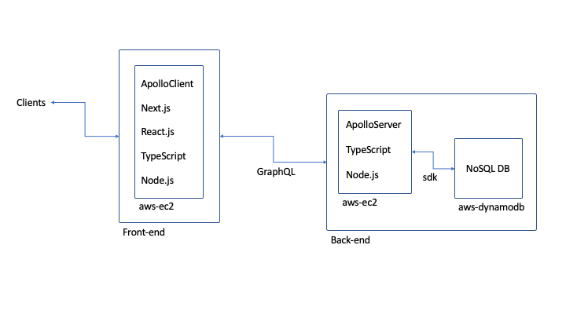
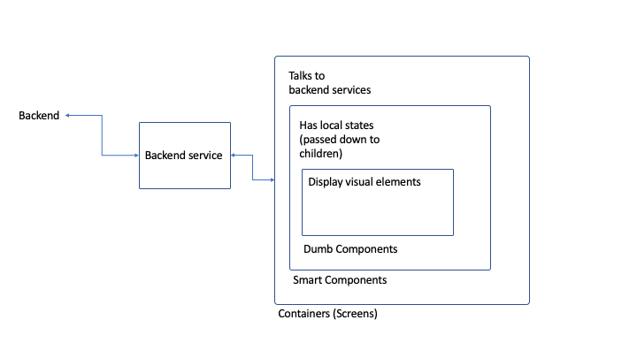

# Duck Feeding Log System

## Architecture

## Technology Stack

### Common

- TypeScript: the static-type-checking language is useful to build scalable
  JavaScript apps
- GraphQL: the declarative and flexible nature help developers clearly
  communicate the API specs

### Front-end

- React.js: the reactive ui library makes it possible to build interactive web
  app in more convenient way
- Next.js: the server side rendering React framework helps with serving the
  React.js app pre-rendered on the server so that it makes the initial rendering
  faster to the end user
- ApolloClient: the GraphQL library helps to implement GraphQL client with ease

### Back-end

- ApolloServer: the GraphQL library helps to implement GraphQL server with ease
- DynamoDB: the serverless NoSQL database enables flexible database operation
  (especially convenient when type information is stored in GraphQL and
  TypeScript)

## Component structure

The components are organized according to their roles (breakable with reasons):

- Screens

  - receive url parameters
  - talk to other services including backend
  - have children

- Smart components

  - are meaning group of visual components
  - have their own states, passed down to children when needed
  - have children

- Dumb components
  - typically do not have states unless very simple ones
  - draw different visual elements according to props

## Testing

- Could not find much time to add testings but managed to add e2e-testing with
  cypress
  - The e2e test covers a few ideal cases
  - If it was a production app, we could have added more integration tests
    (tests on composite components) and unit tests (tests on single functions)
  - It should also be useful to add snapshot tests for React components
